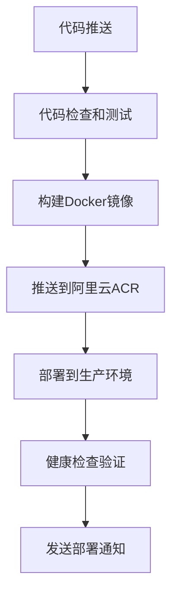

# GitHub Actions 工作流说明

## 概述

本项目使用GitHub Actions实现完整的CI/CD自动化部署流程，包含代码检查、构建、部署、监控和维护等功能。

## 工作流文件说明

### 1. 主要CI/CD流水线 (`ci-cd.yml`)

**触发条件：**
- 推送到 `main` 或 `develop` 分支
- 创建标签 `v*.*.*`
- 创建或更新Pull Request

**执行流程：**


**主要功能：**
- ✅ ESLint代码检查
- ✅ TypeScript类型检查
- ✅ 单元测试执行
- ✅ 应用构建验证
- ✅ Docker镜像构建和推送
- ✅ 自动部署到生产环境
- ✅ 部署后健康检查
- ✅ 部署状态通知

### 2. 手动部署和回滚 (`manual-deploy.yml`)

**触发条件：**
- 手动触发 (workflow_dispatch)

**支持操作：**
- **部署 (deploy)**: 部署指定版本到指定环境
- **回滚 (rollback)**: 回滚到上一个稳定版本或指定版本
- **重启 (restart)**: 重启服务

**使用方法：**
1. 进入GitHub仓库的Actions页面
2. 选择"手动部署和回滚"工作流
3. 点击"Run workflow"
4. 选择操作类型、环境和版本
5. 点击"Run workflow"执行

### 3. 系统维护和清理 (`maintenance.yml`)

**触发条件：**
- 定时执行：每天凌晨2点
- 手动触发

**维护功能：**
- 🧹 清理旧Docker镜像
- 📝 清理过期日志文件
- 💾 清理旧备份文件
- 🔍 系统健康检查
- 📊 生成维护报告

**清理策略：**
- Docker镜像：保留最近5个版本
- 日志文件：保留最近30天
- 备份文件：保留最近20个

### 4. 健康检查和监控 (`health-check.yml`)

**触发条件：**
- 定时执行：每15分钟
- 手动触发

**检查类型：**
- **基础检查 (basic)**: 服务可用性检查
- **性能检查 (performance)**: 响应时间和成功率
- **安全检查 (security)**: HTTP安全头和SSL证书
- **完整检查 (full)**: 包含所有检查项目

**监控指标：**
- 🌐 前端服务可用性
- 🔧 API服务响应时间
- 💾 数据库连接状态
- 🖥️ 服务器资源使用
- 🔒 安全配置检查

## 使用指南

### 首次配置

1. **配置GitHub Secrets**
   ```bash
   # 必需的Secrets
   ACR_USERNAME          # 阿里云ACR用户名
   ACR_PASSWORD          # 阿里云ACR密码
   PROD_SERVER_HOST      # 生产服务器IP
   PROD_SERVER_USER      # SSH用户名
   PROD_SERVER_SSH_KEY   # SSH私钥
   ```

2. **配置GitHub Variables**
   ```bash
   PRODUCTION_URL        # 生产环境访问地址
   ```

3. **准备服务器环境**
   ```bash
   # 安装Docker和Docker Compose
   # 创建部署目录：/opt/guessing-pen
   # 配置SSH密钥访问
   ```

### 日常使用

#### 自动部署
推送代码到main分支即可自动触发部署：
```bash
git push origin main
```

#### 手动部署指定版本
1. 进入Actions页面
2. 选择"手动部署和回滚"
3. 选择"deploy"操作
4. 输入版本号（如：v1.0.0）
5. 执行部署

#### 紧急回滚
1. 进入Actions页面
2. 选择"手动部署和回滚"
3. 选择"rollback"操作
4. 可指定回滚版本或使用上一个稳定版本
5. 执行回滚

#### 健康检查
1. 进入Actions页面
2. 选择"健康检查和监控"
3. 选择检查类型（basic/performance/security/full）
4. 执行检查

### 版本管理

#### 版本标签规范
- **开发版本**: `main-{commit-hash}`
- **预发布版本**: `v1.0.0-rc.1`
- **正式版本**: `v1.0.0`

#### 创建发布版本
```bash
# 创建标签
git tag v1.0.0
git push origin v1.0.0

# 自动触发版本发布流程
```

## 监控和告警

### 自动监控
- ⏰ 每15分钟检查服务健康状态
- 🚨 服务异常时自动发送告警
- 📊 每天生成系统维护报告

### 告警通知
支持多种通知方式：
- 钉钉机器人
- 企业微信机器人
- Slack Webhook
- 邮件通知

### 监控指标
- 服务可用性：99.9%目标
- 响应时间：<2秒
- 错误率：<5%
- 资源使用：CPU<80%, 内存<80%

## 故障排查

### 常见问题

#### 1. 部署失败
**可能原因：**
- 镜像构建失败
- 服务器连接问题
- 容器启动失败

**排查步骤：**
1. 查看GitHub Actions日志
2. 检查服务器Docker状态
3. 查看容器日志
4. 验证环境配置

#### 2. 健康检查失败
**可能原因：**
- 服务端口未监听
- 数据库连接问题
- 网络配置错误

**排查步骤：**
1. 手动访问健康检查端点
2. 检查服务进程状态
3. 验证网络连通性
4. 查看应用日志

#### 3. ACR推送失败
**可能原因：**
- 认证信息错误
- 网络连接问题
- 镜像大小超限

**排查步骤：**
1. 验证ACR用户名和密码
2. 检查网络连接
3. 优化镜像大小
4. 重试推送操作

### 日志查看

#### GitHub Actions日志
- 在仓库Actions页面查看工作流执行日志
- 每个步骤都有详细输出信息

#### 服务器日志
```bash
# 部署日志
tail -f /opt/guessing-pen/logs/deploy-*.log

# 容器日志
docker-compose -f /opt/guessing-pen/docker-compose.prod.yml logs -f

# 系统日志
journalctl -u docker -f
```

## 最佳实践

### 开发流程
1. 功能开发在feature分支
2. 创建PR进行代码审查
3. 合并到main分支自动部署
4. 创建标签发布正式版本

### 安全实践
- 定期轮换SSH密钥和ACR密码
- 使用最小权限原则
- 不在日志中输出敏感信息
- 定期更新依赖和基础镜像

### 性能优化
- 使用Docker多阶段构建
- 启用镜像缓存
- 优化镜像大小
- 并行执行构建任务

### 监控优化
- 设置合理的健康检查间隔
- 配置告警阈值
- 定期清理旧数据
- 监控资源使用情况

---

**需要帮助？**
- 查看详细配置文档：[GITHUB_ACTIONS_SETUP.md](../deployment/GITHUB_ACTIONS_SETUP.md)
- 查看环境配置示例：[env-example.yml](./env-example.yml)
- 联系项目维护团队