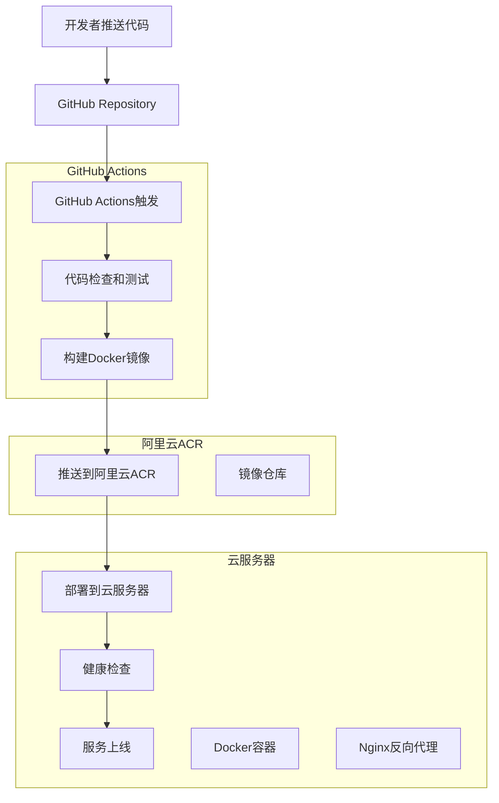

# Docker + 阿里云ACR + GitHub Actions 自动化部署设计文档

## 概述

本文档描述了使用Docker容器化、阿里云容器镜像服务(ACR)和GitHub Actions实现自动化部署的技术设计方案。

## 架构设计

### 整体架构图



### 部署流程设计

1. **代码提交阶段**
   - 开发者推送代码到GitHub main分支
   - GitHub Actions自动触发CI/CD流水线

2. **构建阶段**
   - 执行代码质量检查（ESLint、TypeScript）
   - 运行单元测试
   - 构建生产版本的前端和API

3. **容器化阶段**
   - 使用多阶段Docker构建优化镜像大小
   - 为镜像添加版本标签和元数据
   - 推送镜像到阿里云ACR

4. **部署阶段**
   - SSH连接到云服务器
   - 从ACR拉取最新镜像
   - 停止旧容器，启动新容器
   - 执行健康检查

## 组件设计

### 1. Docker配置

#### 前端Dockerfile
```dockerfile
# 多阶段构建 - 构建阶段
FROM node:18-alpine AS builder
WORKDIR /app
COPY package*.json ./
RUN npm ci --only=production
COPY . .
RUN npm run build

# 生产阶段
FROM nginx:alpine
COPY --from=builder /app/dist /usr/share/nginx/html
COPY nginx.conf /etc/nginx/nginx.conf
EXPOSE 80
CMD ["nginx", "-g", "daemon off;"]
```

#### API Dockerfile
```dockerfile
FROM node:18-alpine
WORKDIR /app
COPY package*.json ./
RUN npm ci --only=production
COPY . .
EXPOSE 3005
CMD ["node", "scripts/development/server-dev.js"]
```

#### Docker Compose配置
```yaml
version: '3.8'
services:
  frontend:
    build:
      context: .
      dockerfile: Dockerfile.frontend
    ports:
      - "80:80"
    environment:
      - NODE_ENV=production
    depends_on:
      - api

  api:
    build:
      context: .
      dockerfile: Dockerfile.api
    ports:
      - "3005:3005"
    environment:
      - NODE_ENV=production
      - DB_HOST=${DB_HOST}
      - DB_PORT=${DB_PORT}
      - DB_USER=${DB_USER}
      - DB_PASSWORD=${DB_PASSWORD}
      - DB_NAME=${DB_NAME}
```

### 2. GitHub Actions工作流

#### 主要工作流文件结构
```yaml
name: CI/CD Pipeline
on:
  push:
    branches: [main]
  pull_request:
    branches: [main]

jobs:
  test:
    runs-on: ubuntu-latest
    steps:
      - name: Checkout code
      - name: Setup Node.js
      - name: Install dependencies
      - name: Run tests
      - name: Build application

  build-and-deploy:
    needs: test
    runs-on: ubuntu-latest
    if: github.ref == 'refs/heads/main'
    steps:
      - name: Build Docker images
      - name: Login to Alibaba Cloud ACR
      - name: Push images to ACR
      - name: Deploy to server
```

### 3. 阿里云ACR集成

#### 镜像命名规范
- 仓库地址：`registry.cn-hangzhou.aliyuncs.com/[namespace]/[repository]`
- 标签规范：
  - `latest` - 最新稳定版本
  - `v1.0.0` - 语义化版本号
  - `main-{commit-hash}` - 基于提交哈希的版本

#### 镜像推送策略
- 每次main分支提交都推送带有commit hash的镜像
- 只有tagged release才推送语义化版本
- 部署成功后更新latest标签

### 4. 云服务器部署

#### 服务器环境要求
- 操作系统：Ubuntu 20.04+ 或 CentOS 8+
- Docker版本：20.10+
- Docker Compose版本：2.0+
- 网络：能够访问阿里云ACR和GitHub

#### 部署脚本设计
```bash
#!/bin/bash
# deploy.sh

set -e

# 配置变量
ACR_REGISTRY="registry.cn-hangzhou.aliyuncs.com"
NAMESPACE="your-namespace"
IMAGE_TAG=${1:-latest}

# 登录ACR
docker login $ACR_REGISTRY -u $ACR_USERNAME -p $ACR_PASSWORD

# 拉取最新镜像
docker pull $ACR_REGISTRY/$NAMESPACE/guessing-pen-frontend:$IMAGE_TAG
docker pull $ACR_REGISTRY/$NAMESPACE/guessing-pen-api:$IMAGE_TAG

# 停止旧容器
docker-compose down

# 启动新容器
docker-compose up -d

# 健康检查
./health-check.sh
```

## 数据模型

### 环境变量配置
```typescript
interface DeploymentConfig {
  // 数据库配置
  DB_HOST: string
  DB_PORT: number
  DB_USER: string
  DB_PASSWORD: string
  DB_NAME: string
  
  // 阿里云ACR配置
  ACR_REGISTRY: string
  ACR_NAMESPACE: string
  ACR_USERNAME: string
  ACR_PASSWORD: string
  
  // 服务器配置
  SERVER_HOST: string
  SERVER_USER: string
  SERVER_SSH_KEY: string
  
  // 应用配置
  NODE_ENV: 'production' | 'staging'
  API_PORT: number
  FRONTEND_PORT: number
}
```

### GitHub Secrets配置
```yaml
secrets:
  # 阿里云ACR凭证
  ACR_USERNAME: "阿里云ACR用户名"
  ACR_PASSWORD: "阿里云ACR密码"
  ACR_REGISTRY: "registry.cn-hangzhou.aliyuncs.com"
  ACR_NAMESPACE: "你的命名空间"
  
  # 服务器SSH凭证
  SERVER_HOST: "服务器IP地址"
  SERVER_USER: "服务器用户名"
  SERVER_SSH_KEY: "SSH私钥"
  
  # 数据库配置
  DB_HOST: "数据库主机"
  DB_USER: "数据库用户名"
  DB_PASSWORD: "数据库密码"
  DB_NAME: "数据库名称"
```

## 错误处理

### 构建失败处理
- TypeScript编译错误：停止流水线，显示详细错误信息
- 测试失败：停止流水线，生成测试报告
- Docker构建失败：重试一次，失败则停止

### 部署失败处理
- 镜像推送失败：重试3次，记录错误日志
- 服务器连接失败：检查网络和SSH配置
- 容器启动失败：自动回滚到上一个稳定版本
- 健康检查失败：回滚并发送告警通知

### 回滚策略
```bash
# 自动回滚脚本
rollback_to_previous() {
  echo "开始回滚到上一个版本..."
  
  # 获取上一个稳定版本
  PREVIOUS_TAG=$(docker images --format "table {{.Tag}}" | grep -v latest | head -1)
  
  # 停止当前容器
  docker-compose down
  
  # 启动上一个版本
  IMAGE_TAG=$PREVIOUS_TAG docker-compose up -d
  
  # 验证回滚成功
  if ./health-check.sh; then
    echo "回滚成功"
    exit 0
  else
    echo "回滚失败"
    exit 1
  fi
}
```

## 测试策略

### 单元测试
- 前端组件测试：使用Jest和React Testing Library
- API接口测试：使用Jest和Supertest
- 工具函数测试：覆盖率要求80%以上

### 集成测试
- 数据库连接测试
- API端点测试
- 前后端集成测试

### 部署测试
- Docker镜像构建测试
- 容器启动测试
- 健康检查测试
- 回滚功能测试

### 性能测试
- 镜像大小优化（目标：前端<50MB，API<100MB）
- 容器启动时间（目标：<30秒）
- 部署时间（目标：<10分钟）

## 监控和日志

### 应用监控
- 容器资源使用情况
- API响应时间和错误率
- 数据库连接状态
- 前端页面加载性能

### 部署监控
- GitHub Actions执行状态
- 镜像推送成功率
- 部署成功率和时间
- 回滚触发频率

### 日志管理
- 应用日志：使用结构化日志格式
- 部署日志：记录每个步骤的执行结果
- 错误日志：详细记录错误堆栈和上下文
- 审计日志：记录所有部署操作

## 安全考虑

### 镜像安全
- 使用官方基础镜像
- 定期更新基础镜像
- 扫描镜像漏洞
- 最小化镜像内容

### 网络安全
- 使用HTTPS/TLS加密
- 配置防火墙规则
- 限制容器网络访问
- 使用私有镜像仓库

### 访问控制
- GitHub Secrets加密存储
- SSH密钥轮换
- 数据库访问权限最小化
- 定期审查访问权限

---

**设计版本**: 1.0.0  
**最后更新**: 2025年10月11日  
**审核状态**: 待审核