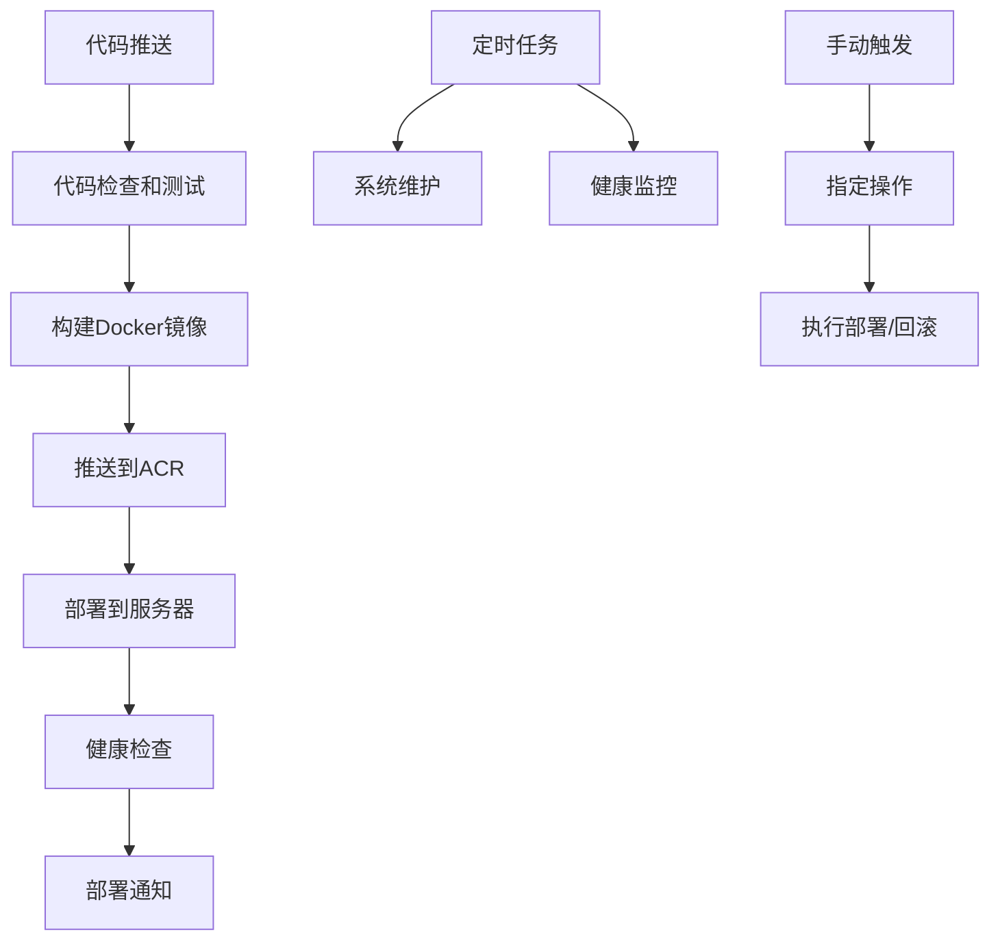

# GitHub Actions CI/CD 配置指南

## 概述

本文档详细说明如何配置GitHub Actions所需的Secrets和Variables，以实现完整的CI/CD自动化部署流程。

## 必需的GitHub Secrets配置

### 阿里云ACR相关
在GitHub仓库的 Settings > Secrets and variables > Actions 中添加以下Secrets：

```
ACR_USERNAME          # 阿里云ACR用户名
ACR_PASSWORD          # 阿里云ACR密码
```

### 生产环境服务器配置
```
PROD_SERVER_HOST      # 生产服务器IP地址
PROD_SERVER_USER      # 生产服务器SSH用户名
PROD_SERVER_SSH_KEY   # 生产服务器SSH私钥
PROD_SERVER_PORT      # 生产服务器SSH端口 (可选，默认22)
```

### 预发布环境服务器配置 (可选)
```
STAGING_SERVER_HOST   # 预发布服务器IP地址
STAGING_SERVER_USER   # 预发布服务器SSH用户名
STAGING_SERVER_SSH_KEY # 预发布服务器SSH私钥
STAGING_SERVER_PORT   # 预发布服务器SSH端口 (可选，默认22)
```

### 通知配置 (可选)
```
WEBHOOK_URL           # 部署通知Webhook地址 (钉钉/企业微信/Slack等)
ALERT_WEBHOOK_URL     # 告警通知Webhook地址
```

## 必需的GitHub Variables配置

在GitHub仓库的 Settings > Secrets and variables > Actions > Variables 中添加：

```
PRODUCTION_URL        # 生产环境访问地址 (如: https://your-domain.com)
STAGING_URL           # 预发布环境访问地址 (可选)
```

## 详细配置步骤

### 1. 阿里云ACR配置

#### 1.1 获取ACR访问凭证
1. 登录阿里云控制台
2. 进入容器镜像服务ACR
3. 在左侧菜单选择"访问凭证"
4. 设置Registry登录密码
5. 记录用户名和密码

#### 1.2 配置GitHub Secrets
```bash
# ACR用户名格式通常为: your-aliyun-account
ACR_USERNAME=your-aliyun-account

# ACR密码为您设置的Registry登录密码
ACR_PASSWORD=your-registry-password
```

### 2. 服务器SSH配置

#### 2.1 生成SSH密钥对
```bash
# 在本地生成SSH密钥对
ssh-keygen -t rsa -b 4096 -C "github-actions@your-domain.com" -f ~/.ssh/github_actions_key

# 查看公钥内容
cat ~/.ssh/github_actions_key.pub

# 查看私钥内容
cat ~/.ssh/github_actions_key
```

#### 2.2 配置服务器SSH访问
```bash
# 在服务器上添加公钥到authorized_keys
echo "your-public-key-content" >> ~/.ssh/authorized_keys

# 设置正确的权限
chmod 600 ~/.ssh/authorized_keys
chmod 700 ~/.ssh
```

#### 2.3 配置GitHub Secrets
```bash
# 生产服务器配置
PROD_SERVER_HOST=your-production-server-ip
PROD_SERVER_USER=your-ssh-username
PROD_SERVER_SSH_KEY=your-private-key-content
PROD_SERVER_PORT=22  # 可选，默认22
```

### 3. 环境配置

#### 3.1 生产环境准备
确保生产服务器已安装：
- Docker 20.10+
- Docker Compose 2.0+
- curl (用于健康检查)

#### 3.2 部署目录结构
```bash
# 在服务器上创建部署目录
sudo mkdir -p /opt/guessing-pen
sudo chown $USER:$USER /opt/guessing-pen

# 创建必要的子目录
cd /opt/guessing-pen
mkdir -p logs backups

# 上传docker-compose.prod.yml文件
# 可以通过SCP或Git拉取
```

### 4. Docker Compose配置

#### 4.1 生产环境配置文件
在服务器的 `/opt/guessing-pen/docker-compose.prod.yml`：

```yaml
version: '3.8'

services:
  frontend:
    image: registry.cn-hangzhou.aliyuncs.com/guessing-pen/guessing-pen-frontend:latest
    ports:
      - "80:80"
    environment:
      - NODE_ENV=production
    restart: unless-stopped
    depends_on:
      - api
    healthcheck:
      test: ["CMD", "curl", "-f", "http://localhost:80/health"]
      interval: 30s
      timeout: 10s
      retries: 3

  api:
    image: registry.cn-hangzhou.aliyuncs.com/guessing-pen/guessing-pen-api:latest
    ports:
      - "3005:3005"
    environment:
      - NODE_ENV=production
      - DB_HOST=${DB_HOST}
      - DB_PORT=${DB_PORT}
      - DB_USER=${DB_USER}
      - DB_PASSWORD=${DB_PASSWORD}
      - DB_NAME=${DB_NAME}
    restart: unless-stopped
    healthcheck:
      test: ["CMD", "curl", "-f", "http://localhost:3005/health"]
      interval: 30s
      timeout: 10s
      retries: 3

networks:
  default:
    name: guessing-pen-network
```

#### 4.2 环境变量配置
在服务器上创建 `/opt/guessing-pen/.env`：

```bash
# 数据库配置
DB_HOST=your-database-host
DB_PORT=5432
DB_USER=your-database-user
DB_PASSWORD=your-database-password
DB_NAME=your-database-name

# 应用配置
NODE_ENV=production
```

### 5. 工作流触发配置

#### 5.1 自动触发条件
- **主分支推送**: 自动触发完整的CI/CD流程
- **PR创建**: 只执行代码检查和测试
- **标签推送**: 触发版本发布流程

#### 5.2 手动触发选项
- **手动部署**: 可指定版本和环境
- **回滚操作**: 可回滚到指定版本或上一个稳定版本
- **维护任务**: 清理镜像、日志等
- **健康检查**: 全面的系统健康检查

### 6. 通知配置 (可选)

#### 6.1 钉钉机器人配置
```bash
# 创建钉钉群机器人，获取Webhook地址
WEBHOOK_URL=https://oapi.dingtalk.com/robot/send?access_token=your-token
```

#### 6.2 企业微信机器人配置
```bash
# 创建企业微信群机器人，获取Webhook地址
WEBHOOK_URL=https://qyapi.weixin.qq.com/cgi-bin/webhook/send?key=your-key
```

## 工作流文件说明

### 主要工作流文件

1. **`.github/workflows/ci-cd.yml`**
   - 主要的CI/CD流水线
   - 包含代码检查、构建、部署
   - 自动触发条件：推送到main分支

2. **`.github/workflows/manual-deploy.yml`**
   - 手动部署和回滚工作流
   - 支持指定版本部署
   - 支持一键回滚功能

3. **`.github/workflows/maintenance.yml`**
   - 系统维护和清理工作流
   - 定时清理旧镜像和日志
   - 系统健康检查

4. **`.github/workflows/health-check.yml`**
   - 定期健康检查和监控
   - 性能监控和告警
   - 安全检查

### 工作流执行顺序



## 安全最佳实践

### 1. Secrets管理
- 定期轮换SSH密钥和ACR密码
- 使用最小权限原则
- 不在日志中输出敏感信息

### 2. 网络安全
- 配置服务器防火墙规则
- 使用SSH密钥而非密码认证
- 定期更新系统和Docker

### 3. 镜像安全
- 定期扫描镜像漏洞
- 使用官方基础镜像
- 及时更新依赖包

## 故障排查

### 常见问题

#### 1. ACR登录失败
```bash
# 检查用户名和密码是否正确
docker login registry.cn-hangzhou.aliyuncs.com -u your-username

# 检查网络连接
ping registry.cn-hangzhou.aliyuncs.com
```

#### 2. SSH连接失败
```bash
# 测试SSH连接
ssh -i your-private-key user@server-ip

# 检查SSH密钥权限
chmod 600 your-private-key
```

#### 3. 部署失败
```bash
# 查看容器日志
docker-compose -f docker-compose.prod.yml logs

# 检查容器状态
docker-compose -f docker-compose.prod.yml ps
```

#### 4. 健康检查失败
```bash
# 手动测试健康检查端点
curl -f http://localhost:80/health
curl -f http://localhost:3005/health

# 检查端口监听
netstat -tuln | grep -E ":80|:3005"
```

### 日志查看

#### GitHub Actions日志
- 在GitHub仓库的Actions页面查看工作流执行日志
- 每个步骤都有详细的执行输出

#### 服务器日志
```bash
# 查看部署日志
tail -f /opt/guessing-pen/logs/deploy-*.log

# 查看维护日志
tail -f /opt/guessing-pen/logs/maintenance-*.log

# 查看容器日志
docker-compose -f /opt/guessing-pen/docker-compose.prod.yml logs -f
```

## 监控和告警

### 1. 自动监控
- 每15分钟执行基础健康检查
- 每天凌晨2点执行系统维护
- 服务异常时自动发送告警

### 2. 手动监控
- 可随时触发全面健康检查
- 支持性能测试和安全检查
- 生成详细的监控报告

### 3. 告警机制
- 服务不可用时立即告警
- 性能异常时发送警告
- SSL证书即将过期时提醒

---

**配置完成后，您的CI/CD流程将实现：**
- ✅ 代码推送自动部署
- ✅ 一键回滚功能
- ✅ 定期系统维护
- ✅ 持续健康监控
- ✅ 异常自动告警

**下一步**: 根据本文档配置完所有Secrets和Variables后，推送代码到main分支即可触发首次自动部署。